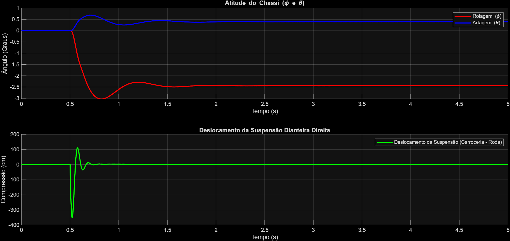

# Análise de Dirigibilidade e Estabilidade Veicular Através de Simulação Multi-Corpos de Alta Fidelidade


## 🎯 Visão Geral do Projeto

Este projeto de engenharia documenta o desenvolvimento de uma ferramenta de simulação de dinâmica veicular construída do zero em **MATLAB** e **Simulink**. O objetivo principal é analisar os fundamentos da dirigibilidade e estabilidade de um veículo, evoluindo de um modelo simples de 3 Graus de Liberdade (DOF) para um modelo de alta fidelidade de até 14-DOF.

O projeto serve como um estudo aprofundado dos princípios da física veicular e como um portfólio prático de modelagem matemática, simulação de sistemas dinâmicos e resolução de problemas de engenharia. O processo inclui um ciclo completo de desenvolvimento: da revisão teórica e implementação, passando por uma extensiva fase de depuração, até a validação final dos resultados contra a teoria estabelecida.

## 🛠️ Ferramentas e Conceitos Chave

* **Software Principal:** MATLAB, Simulink
* **Controle de Versão:** Git, GitHub
* **Conceitos de Dinâmica Veicular:**
    * Sistemas de Coordenadas SAE J670e
    * Modelo Bicicleta (3-DOF)
    * **Modelo de 1/4 de Veículo (2-DOF)**
    * **Modelo de Veículo Completo (8-DOF)**
    * Dinâmica de Rolagem (Roll), Arfagem (Pitch) e Guinada (Yaw)
    * Transferência de Carga Lateral
    * Magic Formula de Pacejka

## 📁 Estrutura do Projeto

O repositório está organizado de forma modular para garantir clareza e manutenibilidade:

```
/Analise_Dirigibilidade_Estabilidade/
|-- 01_Modelos_Simulink/  # Arquivos .slx dos modelos
|-- 02_Scripts_MATLAB/    # Scripts .m para parâmetros e análises
|-- 03_Resultados/        # Gráficos, GIFs e dados exportados
|-- README.md             # Esta documentação
`-- .gitignore            # Arquivos ignorados pelo Git
```

## 📈 Fases do Projeto

O desenvolvimento segue um plano incremental:

-   [x] **Fase 0: A Fundação** - Preparação do ambiente e revisão teórica.
-   [x] **Fase 1: O Modelo Bicicleta (3-DOF)** - Validação do modelo lateral linear.
-   [x] **Fase 2: Modelo de Pneu Não-Linear (Pacejka)** - Simulação no limite da aderência.
-   [x] **Fase 3: Dinâmica de Rolagem e Transferência de Carga (4-DOF)** - Modelagem da inclinação da carroceria.
-   [x] **Fase 4: A Simulação Completa (8-DOF)** - Integração das dinâmicas verticais, de rolagem e arfagem.
-   [ ] **Fase 5: Análise e Visualização Final**

## 📊 Resultados

### Fase 1-3: Evolução do Modelo de Dirigibilidade

As fases iniciais validaram a dinâmica lateral, de guinada e de rolagem do veículo. A implementação do modelo de pneu Pacejka (Fase 2) e da transferência de carga (Fase 3) permitiu a simulação realista de manobras, capturando efeitos como a saturação dos pneus e a inclinação da carroceria.

### Fase 4: Simulação do Veículo Completo (Modelo 8-DOF)

Nesta fase, a dinâmica vertical foi integrada ao modelo. Seguindo uma abordagem de "isolar e integrar", um modelo de 1/4 de veículo foi primeiramente validado e depois encapsulado em quatro subsistemas de suspensão. Estes foram acoplados ao modelo de chassi, que foi expandido para incluir o grau de liberdade de arfagem (pitch).

O modelo final de 8-DOF foi validado com um teste de passagem por obstáculo em uma única roda. Os resultados abaixo demonstram a resposta 3D completa e acoplada do chassi:
1.  **Atitude do Chassi:** O gráfico mostra as respostas de rolagem (`phi`) e arfagem (`theta`) do chassi. Quando a roda dianteira direita sobe, o carro inclina para a esquerda (rolagem negativa) e o nariz levanta (arfagem positiva), como esperado.
2.  **Dinâmica da Suspensão:** O segundo gráfico mostra a compressão da mola e do amortecedor, ilustrando como a suspensão absorve o impacto para suavizar o movimento da carroceria.

> 

## 🚀 Como Executar a Simulação

O projeto é executado através de scripts mestres que controlam cada análise.

## 🔮 Próximos Passos

Com o modelo de alta fidelidade construído e validado, a **Fase 5** se concentrará em utilizar esta ferramenta para:
-   Criar scripts para simular manobras padrão da indústria (ex: Mudança de Faixa Dupla, Slalom).
-   Gerar animações 3D com o **Simulink 3D Animation** para visualizar essas manobras.
-   Finalizar a documentação e consolidar o projeto para o portfólio.

## 📚 Referências

* Milliken, W. F., & Milliken, D. L. (1995). *Race Car Vehicle Dynamics*. SAE International.
* Gillespie, T. D. (1992). *Fundamentals of Vehicle Dynamics*. SAE International.
* Pacejka, H. B. (2006). *Tire and Vehicle Dynamics*. Elsevier.