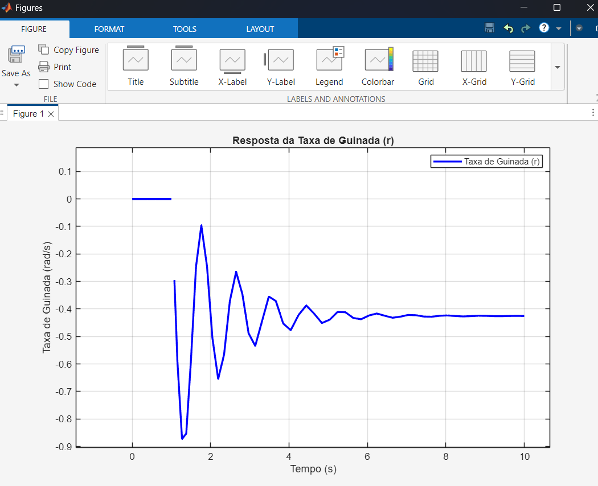
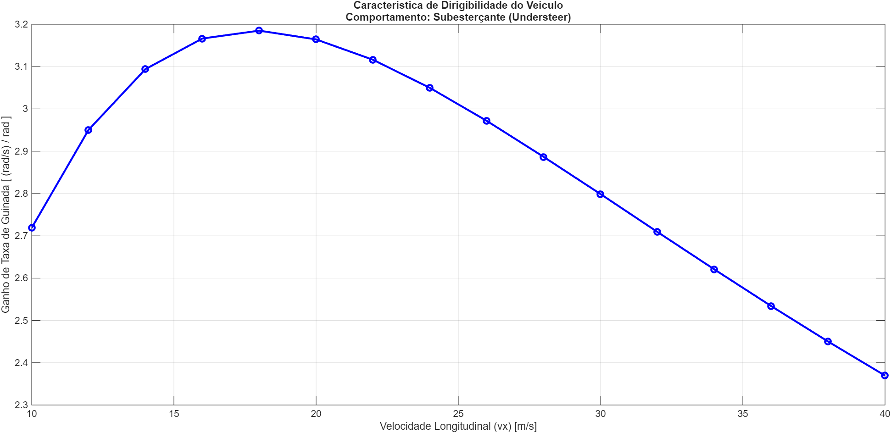

# Análise de Dirigibilidade e Estabilidade Veicular Através de Simulação Multi-Corpos de Alta Fidelidade


## 🎯 Visão Geral do Projeto

Este projeto de engenharia documenta o desenvolvimento de uma ferramenta de simulação de dinâmica veicular construída do zero em **MATLAB** e **Simulink**. O objetivo principal é analisar os fundamentos da dirigibilidade e estabilidade de um veículo, evoluindo de um modelo simples de 3 Graus de Liberdade (DOF) para um modelo de alta fidelidade de até 14-DOF.

O projeto serve como um estudo aprofundado dos princípios da física veicular e como um portfólio prático de modelagem matemática, simulação de sistemas dinâmicos e resolução de problemas de engenharia. O processo inclui um ciclo completo de desenvolvimento: da revisão teórica e implementação, passando por uma extensiva fase de depuração, até a validação final dos resultados contra a teoria estabelecida.

## 🛠️ Ferramentas e Conceitos Chave

* **Software Principal:** MATLAB, Simulink
* **Controle de Versão:** Git, GitHub
* **Conceitos de Dinâmica Veicular:**
    * Sistemas de Coordenadas SAE J670e
    * Modelo Bicicleta (3-DOF)
    * **Magic Formula de Pacejka**
    * **Saturação de Pneu**
    * Dirigibilidade: Subesterço (Understeer) e Sobre-esterço (Oversteer)
    * Ganho de Taxa de Guinada (Yaw Rate Gain)

## 📁 Estrutura do Projeto

O repositório está organizado de forma modular para garantir clareza e manutenibilidade:

```
/Analise_Dirigibilidade_Estabilidade/
|-- 01_Modelos_Simulink/  # Arquivos .slx dos modelos
|-- 02_Scripts_MATLAB/    # Scripts .m para parâmetros e análises
|-- 03_Resultados/        # Gráficos, GIFs e dados exportados
|-- README.md             # Esta documentação
`-- .gitignore            # Arquivos ignorados pelo Git
```

## 📈 Fases do Projeto

O desenvolvimento segue um plano incremental:

-   [x] **Fase 0: A Fundação** - Preparação do ambiente e revisão teórica.
-   [x] **Fase 1: O Modelo Bicicleta (3-DOF)** - Implementação e validação do modelo linear.
-   [x] **Fase 2: Introduzindo o Modelo de Pneu Não-Linear (Pacejka)** - Simulação do comportamento no limite da aderência.
-   [ ] **Fase 3: Adicionando a Dinâmica de Rolagem (Roll) e Transferência de Carga (4-DOF)**
-   [ ] **Fase 4: A Simulação Completa (7-DOF a 14-DOF)**
-   [ ] **Fase 5: Análise e Visualização Final**

## 📊 Resultados da Fase 1

A primeira fase do projeto foi concluída e validada com sucesso.

### 1. Validação do Modelo: Resposta ao Degrau

Para verificar a estabilidade fundamental do modelo, uma simulação com entrada degrau no volante (`delta`) foi executada. O gráfico abaixo mostra a resposta da taxa de guinada (`r`) e da velocidade lateral (`vy`). A resposta oscilatória que se estabiliza em um valor de regime permanente confirma o comportamento estável de segunda ordem do sistema, como esperado pela teoria.

> 

### 2. Análise de Característica de Dirigibilidade

Uma ferramenta de análise foi desenvolvida em MATLAB para automatizar a execução do modelo Simulink em uma ampla faixa de velocidades (10 a 40 m/s). O script calcula o ganho de taxa de guinada em regime permanente e plota a curva característica do veículo.

Após um processo iterativo de ajuste de parâmetros (distribuição de peso, rigidez dos pneus e momento de inércia), o modelo foi configurado para exibir um comportamento **subesterçante**, que é o padrão de segurança para veículos de passeio. O gráfico abaixo demonstra este comportamento, indicado pela queda do ganho em altas velocidades.

> 

### Fase 2: Análise do Modelo Não-Linear (Pacejka)

Para validar a implementação do modelo de pneu não-linear de Pacejka, duas simulações foram comparadas: uma com esterçamento de baixa amplitude (0.05 rad) e outra com alta amplitude (0.20 rad).

O gráfico comparativo abaixo demonstra o efeito de **saturação do pneu**. Enquanto a entrada de esterçamento foi 4x maior, a resposta da taxa de guinada foi significativamente menor que 4x, provando que o ganho do sistema diminui em manobras agressivas. Isso confirma que o modelo agora captura corretamente o comportamento do veículo no limite da aderência.

> 

### 🚀 Como Executar a Simulação

O projeto é executado através de scripts mestres que controlam cada análise.

## 🔮 Próximos Passos

O próximo grande passo é a **Fase 3**, onde a dinâmica de rolagem (inclinação da carroceria) será adicionada ao modelo. Isso introduzirá o conceito de **transferência de carga lateral**, onde o peso é transferido para as rodas externas durante uma curva, alterando a capacidade de aderência de cada pneu em tempo real e aumentando ainda mais o realismo da simulação.

## 📚 Referências

* Milliken, W. F., & Milliken, D. L. (1995). *Race Car Vehicle Dynamics*. SAE International.
* Gillespie, T. D. (1992). *Fundamentals of Vehicle Dynamics*. SAE International.
* Pacejka, H. B. (2006). *Tire and Vehicle Dynamics*. Elsevier.
