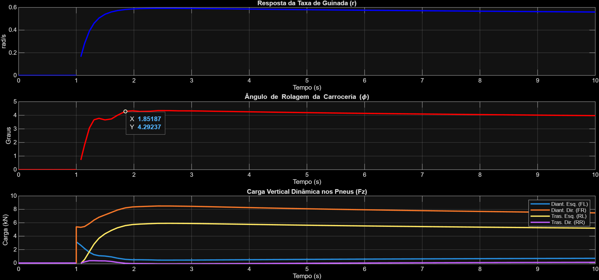

# Análise de Dirigibilidade e Estabilidade Veicular Através de Simulação Multi-Corpos de Alta Fidelidade


## 🎯 Visão Geral do Projeto

Este projeto de engenharia documenta o desenvolvimento de uma ferramenta de simulação de dinâmica veicular construída do zero em **MATLAB** e **Simulink**. O objetivo principal é analisar os fundamentos da dirigibilidade e estabilidade de um veículo, evoluindo de um modelo simples de 3 Graus de Liberdade (DOF) para um modelo de alta fidelidade de até 14-DOF.

O projeto serve como um estudo aprofundado dos princípios da física veicular e como um portfólio prático de modelagem matemática, simulação de sistemas dinâmicos e resolução de problemas de engenharia. O processo inclui um ciclo completo de desenvolvimento: da revisão teórica e implementação, passando por uma extensiva fase de depuração, até a validação final dos resultados contra a teoria estabelecida.

## 🛠️ Ferramentas e Conceitos Chave

* **Software Principal:** MATLAB, Simulink
* **Controle de Versão:** Git, GitHub
* **Conceitos de Dinâmica Veicular:**
    * Sistemas de Coordenadas SAE J670e
    * Modelo Bicicleta (3-DOF) -> **Modelo com Rolagem (4-DOF)**
    * **Dinâmica de Rolagem (Roll)**
    * **Transferência de Carga Lateral**
    * Magic Formula de Pacejka
    * Saturação de Pneu
    * Dirigibilidade: Subesterço (Understeer) e Sobre-esterço (Oversteer)

## 📁 Estrutura do Projeto

O repositório está organizado de forma modular para garantir clareza e manutenibilidade:

```
/Analise_Dirigibilidade_Estabilidade/
|-- 01_Modelos_Simulink/  # Arquivos .slx dos modelos
|-- 02_Scripts_MATLAB/    # Scripts .m para parâmetros e análises
|-- 03_Resultados/        # Gráficos, GIFs e dados exportados
|-- README.md             # Esta documentação
`-- .gitignore            # Arquivos ignorados pelo Git
```

## 📈 Fases do Projeto

O desenvolvimento segue um plano incremental:

-   [x] **Fase 0: A Fundação** - Preparação do ambiente e revisão teórica.
-   [x] **Fase 1: O Modelo Bicicleta (3-DOF)** - Implementação e validação do modelo linear.
-   [x] **Fase 2: Introduzindo o Modelo de Pneu Não-Linear (Pacejka)** - Simulação do comportamento no limite da aderência.
-   [x] **Fase 3: Adicionando a Dinâmica de Rolagem e Transferência de Carga (4-DOF)** - Modelagem da inclinação da carroceria e seu efeito nos pneus.
-   [ ] **Fase 4: A Simulação Completa (7-DOF a 14-DOF)**
-   [ ] **Fase 5: Análise e Visualização Final**

## 📊 Resultados

### Fase 1 & 2: Validação dos Modelos Linear e Não-Linear

As fases iniciais validaram o comportamento de guinada do veículo e a implementação do modelo de pneu Pacejka, que captura corretamente o efeito de **saturação do pneu** (perda de ganho em manobras agressivas).

> **[NOTA: Substitua pelo seu gráfico comparativo da Fase 2]**
> 

### Fase 3: Análise do Modelo com Rolagem e Transferência de Carga (4-DOF)

Nesta fase, a dinâmica de rolagem foi adicionada, transformando o modelo em 4-DOF. A simulação de uma manobra de degrau no volante agora demonstra três comportamentos físicos interligados: a resposta de guinada, a inclinação da carroceria e a transferência de carga resultante sobre os pneus.

O gráfico abaixo valida o modelo de 4-DOF:
1.  **Taxa de Guinada:** O veículo entra em uma curva estável.
2.  **Ângulo de Rolagem:** A carroceria se inclina para um ângulo fisicamente realista e se estabiliza.
3.  **Carga Vertical:** O peso é claramente transferido dos pneus internos (FL, RL) para os externos (FR, RR), o que afeta a capacidade de aderência de cada pneu individualmente.

> **[NOTA: Substitua pelo seu gráfico completo da Fase 3]**
> 

## 🚀 Como Executar a Simulação

O projeto é executado através de scripts mestres que controlam cada análise.

## 🔮 Próximos Passos

O próximo grande passo é a **Fase 4**, onde a **dinâmica vertical** será integrada ao modelo. Isso envolve modelar as molas e amortecedores de cada suspensão, permitindo simular o comportamento do veículo em pistas irregulares e analisar o movimento de arfagem (pitch) durante acelerações e frenagens.

## 📚 Referências

* Milliken, W. F., & Milliken, D. L. (1995). *Race Car Vehicle Dynamics*. SAE International.
* Gillespie, T. D. (1992). *Fundamentals of Vehicle Dynamics*. SAE International.
* Pacejka, H. B. (2006). *Tire and Vehicle Dynamics*. Elsevier.